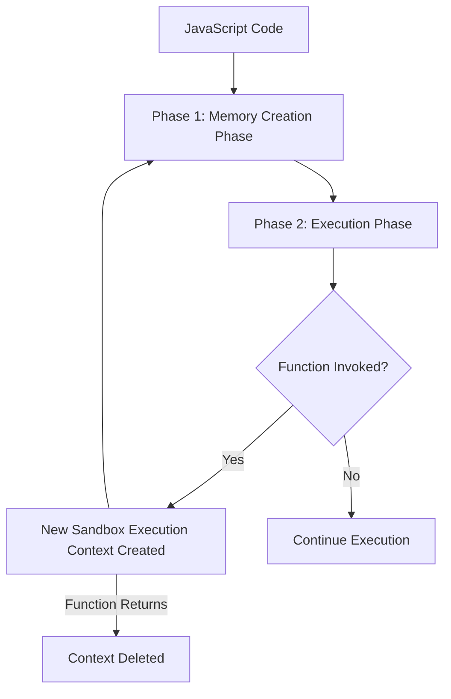

# JavaScript Execution Context & Control Flow - Notes

## 1. JAVASCRIPT EXECUTION CONTEXT (JEC)

When the JavaScript engine executes your code, it creates an environment called the **Execution Context**. This context manages the execution of the code.

JavaScript is **single-threaded** and executes code in a **synchronous, block-by-block (line-by-line)** manner.

### Types of Execution Contexts
1. **Global Execution Context (GEC):** 
   - The default context where code begins execution.
   - Associated with a global object (`window` in browsers, `global` or `{}` in Node.js).
   - Referred to using the `this` keyword.
2. **Function Execution Context (FEC):**
   - Created every time a function is invoked.
   - Each function has its own local execution context.
3. **Eval Execution Context:**
   - Created when code is executed inside the `eval()` function (rarely used in modern JS).

---

## 2. THE TWO-PHASE EXECUTION CYCLE

JavaScript runs your code in two main phases:



### Phase 1: Memory Creation Phase
In this phase, JavaScript scans the code and allocates memory to variables and functions. No values are assigned to variables yet.
- **Variables** (declared with `var`, `let`, `const`) are allocated memory and initialized with the placeholder value `undefined`.
- **Functions** are stored with their entire function definition/body.

### Phase 2: Execution Phase
In this phase, code is executed line-by-line.
- Variables are assigned their actual values.
- Calculations are performed.
- When a function is called, a **new sandbox execution context** (containing its own Memory Phase and Execution Phase) is created.
- Once the function finishes its work (returns a value), its execution context is **deleted/destroyed**.

---

### Step-by-Step Execution Example

Consider this code:
```javascript
let val1 = 10;
let val2 = 5;

function addNum(num1, num2) {
    let total = num1 + num2;
    return total;
}

let result1 = addNum(val1, val2);
let result2 = addNum(10, 2);
```

Here is how JS executes this step-by-step:

#### 1. Global Execution Context (GEC) is created
- Pushed onto the Call Stack.
- `this` points to the global object.

#### 2. Memory Creation Phase (for GEC)
- `val1` $\rightarrow$ `undefined`
- `val2` $\rightarrow$ `undefined`
- `addNum` $\rightarrow$ `function definition`
- `result1` $\rightarrow$ `undefined`
- `result2` $\rightarrow$ `undefined`

#### 3. Execution Phase (for GEC)
- `val1` $\leftarrow$ `10`
- `val2` $\leftarrow$ `5`
- Line 8: `result1` invokes `addNum(val1, val2)`:
  - **New Function Execution Context (FEC)** is created for `addNum`.
  - **FEC Memory Phase:**
    - `num1` $\rightarrow$ `undefined`
    - `num2` $\rightarrow$ `undefined`
    - `total` $\rightarrow$ `undefined`
  - **FEC Execution Phase:**
    - `num1` $\leftarrow$ `10`
    - `num2` $\leftarrow$ `5`
    - `total` $\leftarrow$ `10 + 5 = 15`
    - `total` is returned to the GEC.
  - The FEC is **destroyed**.
- `result1` $\leftarrow$ `15`
- Line 9: `result2` invokes `addNum(10, 2)`:
  - **New FEC** is created.
  - **FEC Memory Phase:** Same structure as above.
  - **FEC Execution Phase:**
    - `num1` $\leftarrow$ `10`
    - `num2` $\leftarrow$ `2`
    - `total` $\leftarrow$ `10 + 2 = 12`
    - `total` is returned to the GEC.
  - The FEC is **destroyed**.
- `result2` $\leftarrow$ `12`

---

## 3. CALL STACK

The **Call Stack** keeps track of the execution contexts. It operates on a **LIFO (Last In, First Out)** data structure.

- When script execution starts, the **Global Execution Context** is pushed to the bottom of the stack.
- Whenever a function is invoked, its **Function Execution Context** is pushed to the top of the stack.
- When the function returns, its context is popped off the stack, transferring control back to the context below it.

```
|                  |
|  addNum() FEC    |  <-- Pushed on function call, popped on return
|__________________|
|    Global EC     |  <-- Pushed at start of script execution
|__________________|
    CALL STACK
```

---

## 4. CONTROL FLOW IN JAVASCRIPT

Control flow refers to the order in which statements are executed in a program.

### Conditional Statements (`if`, `else if`, `else`)
Allows executing code blocks conditionally based on comparisons.

```javascript
const balance = 500;

if (balance < 500) {
    console.log("Balance is low");
} else if (balance === 500) {
    console.log("Balance is exactly 500");
} else {
    console.log("Balance is high");
}
```

#### Comparison Operators:
- `<` (Less than), `>` (Greater than)
- `<=` (Less than or equal), `>=` (Greater than or equal)
- `==` (Loose equality - converts types before comparison: `2 == "2"` is `true`)
- `===` (Strict equality - checks both value and type: `2 === "2"` is `false`)
- `!=` (Loose inequality)
- `!==` (Strict inequality)

#### Logical Operators:
- `&&` (AND): True if both conditions are true.
- `||` (OR): True if at least one condition is true.
- `!` (NOT): Inverts the boolean value.

---

### The `switch` Statement
An alternative to writing long chain `if-else` blocks when checking one variable against multiple fixed values.

```javascript
const month = 3;

switch (month) {
    case 1:
        console.log("January");
        break;
    case 2:
        console.log("February");
        break;
    case 3:
        console.log("March"); // Matches this case!
        break;
    default:
        console.log("Default case");
        break;
}
```
> [!IMPORTANT]
> **Why `break` is critical:** If `break` is omitted, the engine will continue executing all subsequent cases (including their code blocks) after the matching case, without evaluating them, until it hits a `break` or the end of the switch block. *Note: Only the `default` block is skipped if a match is found before it (unless there is no break).*

---

### Truthy and Falsy Values

Every value in JavaScript has an inherent boolean value (either `true` or `false`) when evaluated in a boolean context.

#### Falsy Values:
These values always evaluate to `false`:
1. `false`
2. `0` (and `-0`)
3. `0n` (BigInt zero)
4. `""` (Empty string)
5. `null`
6. `undefined`
7. `NaN` (Not a Number)

#### Truthy Values:
All values that are not falsy are **truthy**. Some surprising truthy values include:
- `"0"` (string containing zero)
- `'false'` (string containing false)
- `" "` (string containing a space)
- `[]` (empty array)
- `{}` (empty object)
- `function(){}` (empty function)

#### Checking for Empty Arrays and Objects:
```javascript
// Check if array is empty
const arr = [];
if (arr.length === 0) {
    console.log("Array is empty");
}

// Check if object is empty
const obj = {};
if (Object.keys(obj).length === 0) {
    console.log("Object is empty");
}
```

---

### Special Operators

#### 1. Nullish Coalescing Operator (`??`)
A logical operator that returns its right-hand side operand when its left-hand side operand is **`null`** or **`undefined`**; otherwise, it returns its left-hand side operand. It is used to provide safe fallback values.

```javascript
let val;

val = 5 ?? 10;          // Output: 5
val = null ?? 10;       // Output: 10
val = undefined ?? 15;  // Output: 15
val = null ?? 10 ?? 20; // Output: 10
```

> [!NOTE]
> Unlike `||` (OR) which returns the right side for any *falsy* value (like `0` or `""`), `??` only falls back if the value is strictly `null` or `undefined`.

#### 2. Ternary Operator
A shorthand syntax for `if-else`.

**Syntax:** `condition ? expressionIfTrue : expressionIfFalse`

```javascript
const price = 80;
price >= 100 ? console.log("Expensive") : console.log("Affordable");
// Output: Affordable
```

---

## 5. KEY TAKEAWAYS

1. JavaScript runs code in two phases: **Memory Creation Phase** (variables set to `undefined`, functions defined) and **Execution Phase** (code run, values assigned).
2. Every function invocation creates a temporary **Execution Context** which gets pushed onto the **Call Stack** and is deleted on completion.
3. Use strict equality (`===`) to avoid unexpected type-coercion bugs.
4. Keep in mind that `[]` and `{}` are **truthy**; use `.length` and `Object.keys()` to verify if they are empty.
5. Use `??` to set fallback values specifically for `null` and `undefined`.